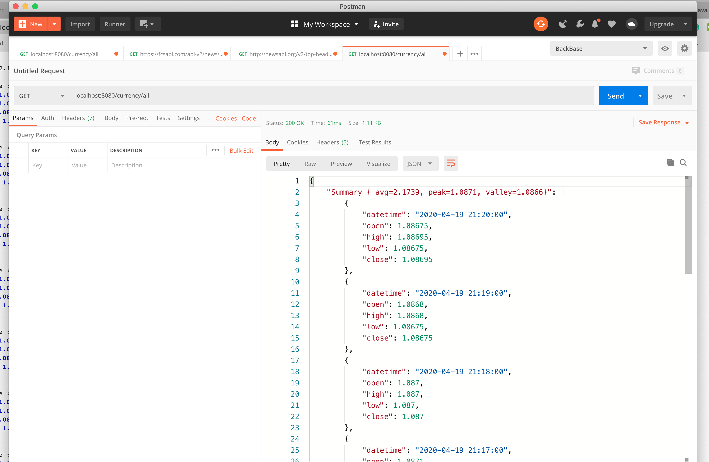

# SpringBoot Forex Currency API

This is a project with minimum features for testing purpose regarding currency pair in Forex market. 

## Getting Started

These instructions will get you a copy of the project up and running on your local machine for development and testing purposes. 

### Prerequisites

Please make sure your development sandbox meets below requirements:

```
Java Version 8 
```

### Installing

To get the dev environment up and running you have 2 options: Running through IDE using maven wrapper or using the Dockerfile to run in container mode.

In order to run the app through **IDE**:

-   Using **IntellijIDEA** open the pom.xml file and choose to open as Project. Then simply run the app.

-   Alternatively, to run in **Docker** mode, simply run below command in the Terminal/Command prompt:

```bash
docker build -t spring-forex-api .
```

This would make the Docker image.

Finally to make app container up and running:

```bash
docker run -p 8080:8080 -t spring-forex-api
```

Once the app is up and running, it would fetch and refresh data in database each 60 seconds using spring boot **scheduler**. 

In order to reduce the api hit limit, I have used **Ehcache** caching system.

If you have done all above steps correct, you can simply use **POSTMAN** or your browser to hit below endpoint:

`GET: /currency/all`




>   The **Summary** attribute is calculated programmatically to give a brief analysis of the prices.

 

## Running the tests

The testing framework used for this project is **JUnit**. In order to run tests, in command line type:

```bash
mvn test
```


## License

This project is licensed under the MIT License.

